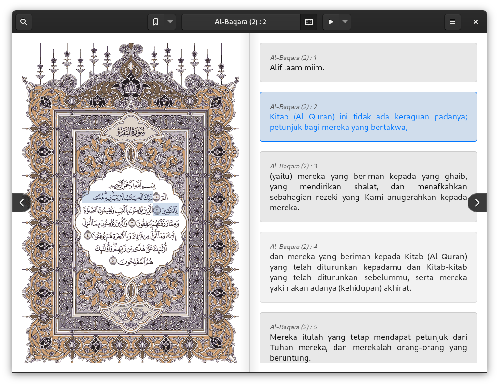

# Grapik Quran

This proof-of-concept application is specially made for the GNOME desktop. We have used [madani Quran images generator](https://github.com/quran/quran_android) to provide the same experience of reading a non-digital Quran. Here's a prototype of the application:

## Background

All I'd like to do is have a digital Quran app installed on my desktop. I know very well that there are many great apps on mobile—such as [Quran for Android](https://play.google.com/store/apps/details?id=com.quran.labs.androidquran) and [Al Quran (Tafsir & by Word)](https://play.google.com/store/apps/details?id=com.greentech.quran)—or the web—such as [Ayat](https://quran.ksu.edu.sa/index.php#aya=1_1&m=hafs&qaree=husary&trans=ar_mu) and [Quran.com](https://quran.com/)—, but I just want one on the desktop at the moment.

Why not just use the Ayat desktop app which was the officially developed by KSU? Unfortunately, due to Adobe AIR has reached [end of life](https://www.adelaide.edu.au/technology/your-services/software/adobe-air-end-of-life) on December 31, 2020, we won't be able to get it from the official Linux distro's repository. Not to mention that Adobe has decided to [no longer support](https://helpx.adobe.com/air/kb/install-air-2-64-bit.html) Adobe AIR for Linux desktop as of June 14, 2011. So, it has been such a pain to install Ayat on Linux since then.

There are many alternatives to Ayat, such as [Zekr](https://sourceforge.net/projects/zekr/), [Elforkane](https://github.com/zakariakov/elforkane), and [Albasheer](https://github.com/yucefsourani/albasheer-electronic-quran-browser). But they don't feel as great as Ayat to me. That's why I've been working hardly on **Grapik Quran** to meet my personal needs. Also that's not less important is learning to develop a real app from people as being open source.
