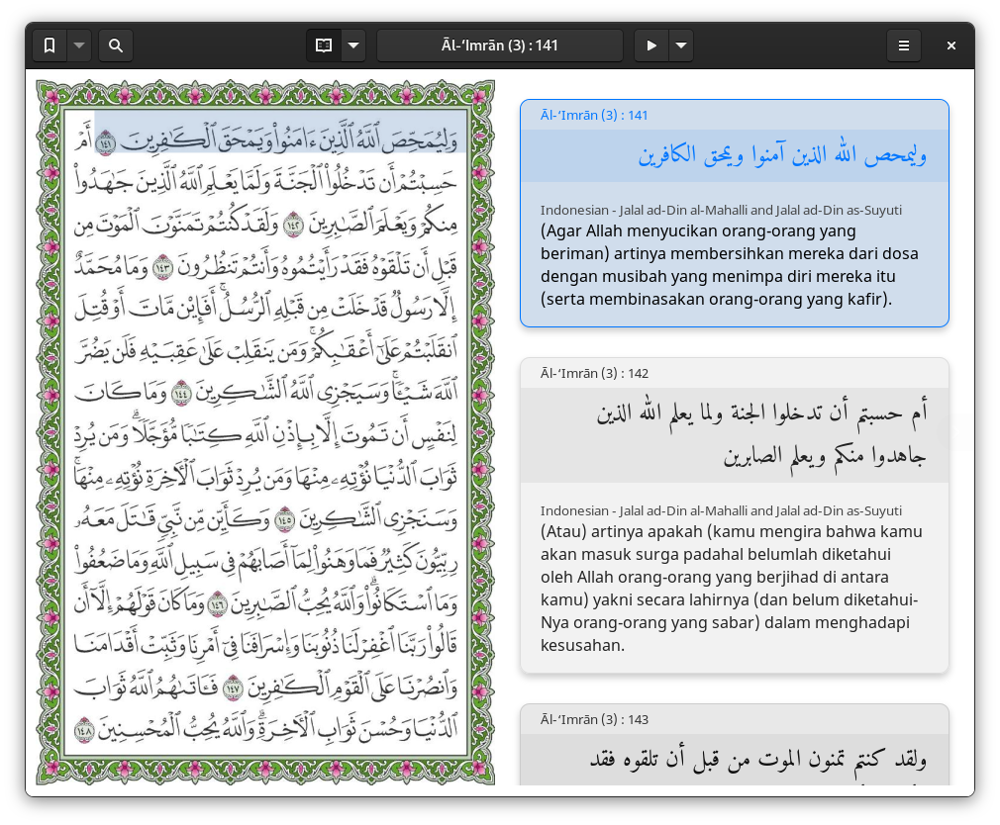

# Grapik Quran

A simple and modern digital Quran app for GNOME desktop.

In the name of Allah, the Entirely Merciful, the Especially Merciful. This proof-of-concept application is specially made for the GNOME desktop. We use Quran images from [Quran Complex](https://qurancomplex.gov.sa/) to provide the same experience of reading a non-digital Quran; Quran table of contents from The Translation of The Meaning of The Quran in Indonesian compiled by the Ministry of Religion of the Republic of Indonesia under the supervision of the Ministry of Islamic Affairs, Da'wah, and Islamic Guidance of the Kingdom of Saudi Arabia in 1441 Hijri; Quran metadata and translations from [Tanzil](http://tanzil.net); Quran interpretations from [King Saud University (KSU)](https://quran.ksu.edu.sa/ayat/?l=en&pg=patches); and recitations from [EveryAyah](https://everyayah.com). Here's a prototype of the app:

<!-- TODO: replace by a video intro -->

## Features

Using this app, you'll be able to:

- [WIP] Download and read any variants of the complete Quran (8 variants in 5 qira'at)
- Navigate to any specific page/surah/ayah/juz/hizb/quarter/manzil/ruku
- Download and read translation in 39 languages
- Download and listen recitation by 41 reciters
- Search for imlaei/tarajem/tafaser by text/transliteration
- Search the table of contents (Indonesian only)
- Bookmark any page

## Background

All I'd like to do is have a digital Quran app installed on my desktop. I know very well that there are many great apps on mobile—such as [Quran for Android](https://play.google.com/store/apps/details?id=com.quran.labs.androidquran) and [Al Quran (Tafsir & by Word)](https://play.google.com/store/apps/details?id=com.greentech.quran)—or the web—such as [Ayat](https://quran.ksu.edu.sa/index.php) and [Quran.com](https://quran.com/)—, but I just want one on the desktop at the moment.

Why not just use the [Ayat](https://quran.ksu.edu.sa/ayat/?l=en) app desktop version which was officially developed by KSU? Unfortunately, due to [Adobe AIR](https://en.wikipedia.org/wiki/Adobe_AIR) has reached [end of life](https://www.adelaide.edu.au/technology/your-services/software/adobe-air-end-of-life) on December 31, 2020, we won't be able to get it from the official GNU/Linux distro's repository. Not to mention that Adobe has decided to [no longer support](https://helpx.adobe.com/air/kb/install-air-2-64-bit.html) Adobe AIR for Linux desktop as of June 14, 2011. So, it has been such a pain to install Ayat on Linux since then.

There're many alternatives to Ayat, such as [Zekr](https://sourceforge.net/projects/zekr/), [Elforkane](https://github.com/zakariakov/elforkane), and [Albasheer](https://github.com/yucefsourani/albasheer-electronic-quran-browser). But they don't feel as great as Ayat to me. That's why I've been working hardly on **Grapik Quran** to meet my personal needs. Also that's not less important is learning to develop a real app from people as being open source.

## Motivation

I used to be a user of Sabily OS and I've been amazed how wonderful it is. I'm planning to revive the idea. May Allah forgive me all along the way by doing this project and I ask Allah for His _taufiq_ and _hidayah_ to the straight path.

## Contributing

The easiest way for beginners is clone this repository to your local computer, then build and run it using [GNOME Builder](https://wiki.gnome.org/Apps/Builder). To enable GTK Inspector, run `gsettings set org.gtk.Settings.Debug enable-inspector-keybinding true` in the runtime terminal. If you are not a developer, you can still contribute by reporting any bugs, translating into your native language, sharing with others, or making dua for all the contributors so that our age will be lengthened and our intentions will be straightened out in working on this project. _La hawla wala quwwata illa billah._

## Licenses

This software is distributed under the terms of the [GNU General Public License (GPL) Version 3](COPYING). For the images and the table of contents credit to Quran Complex under license not for sale. For the metadata credit to Tanzil. For the translations are for non-commercial purposes only and credit to Tanzil. However, there's a disclaimer from Tanzil which I'd like to mention in here to be considered by all of us:

> No translation of Quran can be a hundred percent accurate, nor it can be used as a replacement of the Quran text. We have tried to provide a set of mostly acceptable quran translations here, but we cannot guarantee their authenticity and/or accuracy. Please use them at your own discretion. —[https://tanzil.net/trans/](https://tanzil.net/trans/)

For the recitations credit to EveryAyah. For the phonetic search algorithm and data credit to [Lafzi](https://github.com/lafzi) under GPL-3.0 license. However we've re-written the codebase in Python under the same license as the original. For the fonts, we use [Noto Sans](https://www.google.com/get/noto/) and [Amiri](https://www.amirifont.org/) fonts licensed under the [Open Font License](https://scripts.sil.org/cms/scripts/page.php?site_id=nrsi&id=OFL), both credit to Google Fonts.

## Resources

All of the resources used in this app is as follows:

- [High quality Musshaf PDFs for qira'at Hafs](https://qurancomplex.gov.sa/kfgqpc-quran-hafs/)
- [High quality Musshaf PDFs for other qira'ats](https://qurancomplex.gov.sa/kfgqpc-quran-qiraat/)
- [Mostly acceptable Quran translations](https://tanzil.net/trans/)
- [Quran indexing for qira'at Hafs](https://tanzil.net/docs/quran_metadata)
- [Recitations ayah by ayah](https://everyayah.com/recitations_ayat.html)
- [Processed and labeled data for Grapik Quran](https://sourceforge.net/projects/grapik-quran-data/)
- [Quran search by phonetics](https://github.com/lafzi)
- [Automatic Quran (ayah bounding boxes) labeler](https://github.com/naruaika/my-playground/blob/master/quran-ocr.py)
- [Free licensed font families](https://fonts.google.com/)

## Relevant Articles

Here are some readings that help us make decisions in the development:

- [Organization of the Qur'an](https://www.discoveringislam.org/organization-of-quran.pdf)
- [Eksistensi Alquran Pusaka dalam Perkembangan Mushaf (Indonesian)](http://journal.uinjkt.ac.id/index.php/journal-of-quran-and-hadith/article/view/13381)
- [Transliterasi Al-Quran, antara Hukum dan Kebutuhan (Indonesian)](https://lajnah.kemenag.go.id/artikel/382-transliterasi-al-quran-antara-hukum-dan-kebutuhan)

## Similar Applications

In fact, when designing, we have done some research on similar apps as follows:

- [Zekr](https://sourceforge.net/projects/zekr/)
- [Ayat](https://quran.ksu.edu.sa/)
- [Quran.com](https://quran.com/)
- [Quranflash](https://app.quranflash.com/)
- [iQuran](https://apps.apple.com/us/app/iquran/id285944183)
- [Quran for Android](https://play.google.com/store/apps/details?id=com.quran.labs.androidquran)
- [Al Quran (Tafsir & by Word)](https://play.google.com/store/apps/details?id=com.greentech.quran)
- And many more.
